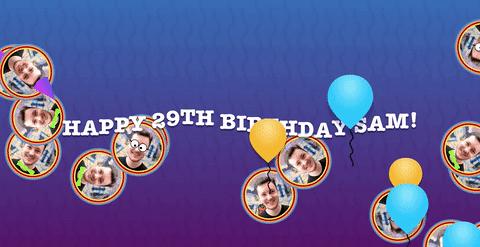

# Sam’s 29th Birthday Sing-Along 🎂🎉

Happy Birthday sing-along for [Sam Cochran](https://github.com/sj26)’s 29th birthday at [Camp JS VII 2016](http://vii.campjs.com). Features CSS Animations, SVG, React and some entertaining components such as [`BirthdayParty`](src/index.js), [`SamsHead`](src/sams-head.js), [`PartyBanner`](src/party-banner.js), [`ExplosionOfSams`](src/explosion-of-sams.js), [`PartyParrot`](src/party-parrot.js) and [`PeruvianPartyHat`](src/peruvian-party-hat.js).

It was originally up on the projector at CampJS but it’s now available at [http://sams-29th-birthday.toolmantim.com](http://sams-29th-birthday.toolmantim.com/) so everyone can join in the birthday celebrations 🍰🎂🎁🎉

## Thanks

* James Hunter ([@orodio](https://github.com/orodio)) for help with the exploding balloon animation
* Fiona Chan ([@mobywhale-chan](https://github.com/mobywhale-chan)), Kylie Gusset ([@gusseting](https://github.com/gusseting)), Melissa Kaulfuss ([@MelissaKaulfuss](https://github.com/MelissaKaulfuss)) and Luke Brooker ([@lukebrooker](https://github.com/lukebrooker)) for the party prop suggestions

## Running it locally

* `git clone`
* `npm install`
* `npm run start`
* `open http://localhost:8000`

## License

MIT (see [License.md](License.md))
